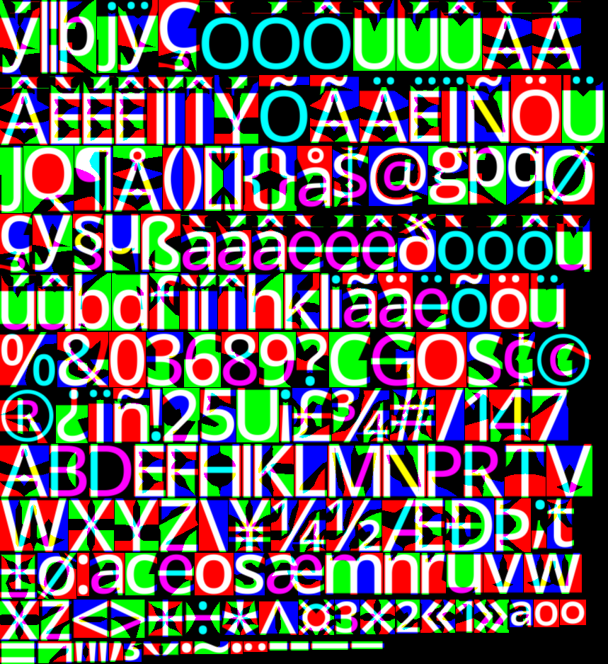

# msdf_font

[msdfgen](https://github.com/Chlumsky/msdfgen) in rust.

Most of it is translated from the original C++ [msdfgen](https://github.com/Chlumsky/msdfgen), and some was taken from [fdsm](https://gitlab.com/Kyarei/fdsm).

## Crate Features

* `atlas`: Atlas generation, based on glyph height.
* `fix_geometry`: For fonts that have overlapping contours, only behind a feature because it uses third party crates.

## Supports

* ✅ MSDF
* ✅ SDF
* ✅ Atlas generation (feature `atlas`)
* ✅ Shape correction (feature `fix_geometry`)
* ❌ Error correction
* ❌ Other types of distance fields

Here we can have a look at a glyph rendered without the `fix_geometry` feature.


And now with the fix in place.


If using `atlas` feature the resulting atlas will look something similar to this.



## Usage

```rust
use image;
use msdf_font::{GlyphBuilder, FieldType, BitmapImageType, ttf_parser};
// use msdf_font::{AtlasBuilder} If using atlas feature.

fn main() {
    let face = ttf_parser::Face::parse(include_bytes("OpenSans.ttf"), 0).unwrap();

    let glyph = GlyphBuilder::new(&face)
        .field_type(FieldType::Msdf { max_angle: 3.0 })
        // .fix_geometry(true) If using fix_geometry feature.
        .px_range(2)
        .px_size(40)
        .build('A')
        // .build_atlas(&['A', 'B', 'C', 'D']) If using atlas feature.
        .unwrap();
      
    image::save_buffer(
        "image.png",
        &glyph.bitmap.bytes,
        glyph.bitmap.width as u32,
        glyph.bitmap.height as u32,
        match glyph.bitmap.image_type {
            BitmapImageType::L8 => image::ColorType::L8,
            BitmapImageType::Rgb8 => image::ColorType::Rgb8,
        }
    ).unwrap();
}
```

You can also see the examples, for the other features.
